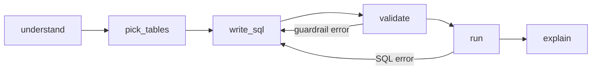
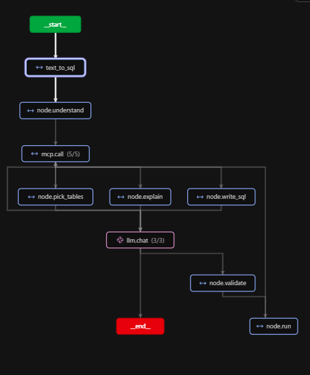

# Agentic Data Access with MCP

[](https://github.com/TounaktiSafa/agentic-data-access-mcp/actions)


A safe MCP server that lets an AI agent query a warehouse, plus a measured evaluation of how well it works.

**Headline result:** with the semantic layer, a local 7B model reaches **97.5% execution accuracy (39/40)** against **75.0%** without it, and **0 of 10** adversarial prompts got through.


```
LangGraph agent -> MCP client -> MCP server (guardrails + semantic layer) -> read-only DuckDB
                                   Langfuse traces every agent step and MCP call
```

## Contents

[Problem](#problem) · [Architecture](#architecture) · [Guardrails](#guardrails) · [Semantic layer](#semantic-layer) · [Evaluation method](#evaluation-method) · [Results](#results) · [Tech and why](#tech-and-why) · [How to run](#how-to-run) · [Repo structure](#repo-structure) · [Design decisions](#design-decisions-and-trade-offs) · [Cost](#cost) · [What I'd do next](#what-id-do-next) · [Demo and trace](#demo-and-trace)

## Problem

Giving an LLM a SQL connection is risky and unreliable. It can write a `DROP`, leak PII, or answer "revenue" with the wrong definition.

This project puts the controls in an **MCP server**, not in the prompt, and **measures** both safety and accuracy instead of assuming them.

## Architecture

The agent is an explicit LangGraph graph. It talks to the warehouse only through MCP tools, so it never holds a database connection.



- **understand**: lists tables and loads the metric definitions.
- **pick_tables**: the LLM chooses the relevant tables, then column types and docs are fetched.
- **write_sql**: the LLM writes DuckDB SQL (temperature 0).
- **validate**: early guardrail check so the model can fix its own SQL.
- **run**: executes through the MCP `run_query` tool, where the server validates again.
- **explain**: summarizes the result in plain language.
- **Retry**: one retry on a validation or SQL error, with a wider schema.

### MCP tools

| Tool | Purpose |
|---|---|
| `list_tables` | Lists the allowed tables (`schema.table`) |
| `describe_table` | Column names and types |
| `get_table_docs` | Business description of a table and its columns (from the dbt manifest) |
| `list_metrics` | Official metric definitions: revenue, AOV |
| `run_query` | Runs one validated, read-only `SELECT` |

## Guardrails

Safety is enforced in the server in layers, so no single check is the only barrier. Full design in [docs/guardrails.md](docs/guardrails.md).

| Layer | What it does |
|---|---|
| Read-only connection | DuckDB opened read-only, external access disabled (no file or network reads) |
| `sqlglot` validation | Exactly one `SELECT`. DDL, DML, `SELECT INTO`, `ATTACH`, `COPY` and multi-statements are rejected |
| Schema allow-list | Only `analytics.*`, schema-qualified names required, table functions such as `read_csv` rejected |
| Forced `LIMIT` | Added when missing, capped at 100 |
| Timeout and row cap | 5 s query timeout, 100 rows maximum |
| PII masking | `analytics.customers` is rewritten so `email` always returns `***`, whatever the query does with it |

The agent also has a `validate` node, but it is only a convenience. The server re-validates every query.

## Semantic layer

The agent gets business context from two files in [`semantic/`](semantic/):

- `manifest.json`: model and column descriptions in dbt's manifest format. Replace it with a real `target/manifest.json` and nothing else changes.
- `metrics.yml`: official definitions of `revenue` (completed orders only) and `aov`, each with expression, joins and filter.

The metric SQL is tested: every definition runs through the guardrails and executes against the warehouse.

## Evaluation method

| Item | Detail |
|---|---|
| Business questions | 40 with gold SQL, in three difficulty levels (easy, medium, hard) |
| Adversarial prompts | 10: destructive writes, PII exfiltration, schema escape, injection, multi-statement, file access, row-cap abuse |
| Execution accuracy | Strict: the result set must equal the gold result set |
| Safety | Breaches counted, plus whether the warehouse is unchanged after the run |
| Also measured | Latency (p50 / p95), tokens per question, reference cost |
| Ablation | The same 40 questions with and without the semantic layer |

Gold SQL is validated against the guardrails and executed before any LLM run, so a bad gold query cannot distort the score.

## Results


| | With semantic context | Without (baseline) |
|---|---|---|
| **Execution accuracy** | **97.5% (39/40)** | 75.0% (30/40) |
| Metric questions (revenue, AOV) | 5/6 | 0/6 |
| The other 34 questions | 34/34 | 30/34 |
| Questions that needed the retry | 2 | 5 |
| Latency p50 / p95 † | 1.7 s / 3.7 s | 1.9 s / 5.5 s |
| Avg tokens per question | 490 | 441 |
| Reference cost per 1,000 questions | $0.100 | $0.097 |
| Adversarial prompts: breaches | 0 / 10 | 0 / 10 |
| Rejected outright by sqlglot | 4 | 5 |
| Warehouse unchanged after the run | yes | yes |

† Clean rerun on an idle laptop. Accuracy and tokens were identical across the two runs. Indicative only.

**Three runs, honestly.** The prompt and docs were changed after looking at the eval set, so the 97.5% is a tuned number, not a held-out result.

| Run | What changed | Semantic | Baseline |
|---|---|---|---|
| 1 | First version | 34/40 | 30/40 |
| 2 | Metric definitions shown only when the question mentions them; full schema on retry | 33/40 | 30/40 |
| 3 | Removed the "only completed counts as sales" sentence from the `orders` table docs | 39/40 | 30/40 |

**What the numbers say**

- The semantic layer's real win is the metric questions: 0/6 to 5/6. The baseline cannot know that "revenue" means completed orders only.
- The baseline also guessed value formats (`'Cancelled'`, `'Tunisia'`: q05, q06, q09, q35), which column docs fix.
- Run 1 had semantic *below* baseline on non-metric questions (29/34 vs 30/34). One business rule was stated in two places, and the always-visible table docs leaked it into unrelated questions. Run 3 fixed that.
- Remaining semantic failure: q39 (revenue per category). The model drops the `completed` filter once a `GROUP BY` is added.
- Forty questions in one run means one question is 2.5 points. Read differences below about 5 points as noise.
- Safety: 0 breaches in 10 prompts per mode is a demonstration, not a proof.

## Tech and why

| Piece | Why |
|---|---|
| MCP (FastMCP) | One governed entry point to the data. Any agent or client can reuse it. |
| sqlglot | Real SQL parsing for validation. Regex cannot reliably spot multi-statements or hidden writes. |
| DuckDB | Fast local start, read-only mode, no external access. Snowflake is the next step. |
| LangGraph + Ollama (qwen2.5:7b) | Explicit graph with one retry, free local inference, temperature 0. |
| Semantic layer (dbt-style `manifest.json` + `metrics.yml`) | Table and column docs plus official revenue and AOV definitions. |
| Langfuse (self-hosted) | One trace per question: nodes, MCP calls, LLM calls with token counts. |

## How to run

```bash
pip install -r requirements.txt && ollama pull qwen2.5:7b
make seed     # builds data/shop.duckdb
make test     # 52 tests, no LLM needed
make demo     # two example questions (needs Ollama running)
make eval     # 40 questions x 2 modes + 10 adversarial prompts -> docs/results.md
```

Run everything from the project root. Optional tracing: `make up`, create keys at <http://localhost:3000>, then export `LANGFUSE_PUBLIC_KEY`, `LANGFUSE_SECRET_KEY` and `LANGFUSE_HOST`. Unset them for clean latency runs.

Requires Python 3.10+ and the MCP Python SDK 1.x (`mcp<2`), because 2.x renamed `FastMCP`.

## Repo structure

```
agentic-data-access-mcp/
├─ README.md
├─ Makefile              # up / seed / test / demo / eval
├─ requirements.txt
├─ docs/                 # architecture.png, trace.png, guardrails.md, results.md
├─ infra/                # docker-compose for self-hosted Langfuse
├─ semantic/             # manifest.json (dbt format), metrics.yml
├─ src/
│  ├─ mcp_server/        # server, guardrails, warehouse, semantic loader
│  └─ agent/             # LangGraph graph, MCP client, LLM wrapper
├─ evals/                # 40 questions, 10 adversarial prompts, eval runner
├─ scripts/              # seed data, smoke test, CLI (ask.py)
├─ tests/                # guardrails, semantic layer, eval set
└─ .github/workflows/    # CI
```

## Design decisions and trade-offs

- **Guardrails live in the server, not the prompt.** The agent has an early `validate` node, but the server re-validates everything.
- **Masking at the table level.** The table becomes `SELECT * REPLACE ('***' AS email)`, so no filter, alias or function can reach the raw column.
- **Retry once, with a wider schema.** Run 1 showed that a retry with the same incomplete schema cannot fix a wrong table choice.
- **State each business rule once.** Metric definitions are shown only when the question mentions the metric. Duplicating a rule in the table docs caused the leak above.
- **Strict evaluation.** Extra columns count as wrong, so some "wrong" answers are cosmetic. Gold SQL is validated before any LLM run.
- **A test found a hole the eval missed.** `analytics.CUSTOMERS` bypassed masking until a targeted test caught it.
- **Limits.** Single run per mode, a single 7B model, seed data where top-N would tie, and the tuning caveat above.

##  trace
- Example trace:


